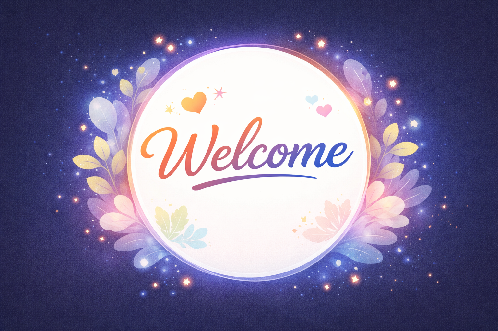

<div align="center">

# 🌐 Abdul Rehim — Portfolio Website



[](https://developer.mozilla.org/en-US/docs/Web/HTML)
[](https://developer.mozilla.org/en-US/docs/Web/CSS)
[](https://developer.mozilla.org/en-US/docs/Web/JavaScript)
[]()

**A modern, animated personal portfolio showcasing frontend development skills and projects.**

[🔗 Live Demo](#) · [📧 Contact](mailto:abdulraheem.pk74@gmail.com) · [🐛 Report Bug](#)

</div>

---

## ✨ Features

- 🎨 **Animated mesh background** with floating particles
- 🌀 **Smooth scroll navigation** with active-state scroll dots
- 🃏 **Glassmorphism cards** with hover animations
- 📱 **Fully responsive** layout for all screen sizes
- 📬 **Working contact form** connected to a live backend (`/send` API)
- ⚡ **Intersection Observer** for scroll-triggered fade-in effects

---

## 📸 Sections

| Section | Description |
|---|---|
| **Welcome** | Hero landing with CTA button |
| **Home** | Introduction and role overview |
| **About** | Background, skills, and tech stack |
| **Services** | Frontend Dev, Backend Dev, Consulting |
| **Projects** | ComplaintMS — image gallery showcase |
| **Contact** | Form with validation + email/phone |

---

## 🛠️ Tech Stack

| Technology | Usage |
|---|---|
| HTML5 | Structure & semantics |
| CSS3 | Animations, gradients, responsive layout |
| Vanilla JavaScript | DOM interaction, form validation, scroll logic |
| Fetch API | Sends form data to backend |
| Google Fonts | *DM Sans* & *Syne* typefaces |

---

## 🚀 Getting Started

### Prerequisites

Just a browser — no build tools or dependencies required.

### Installation

```bash
# 1. Clone the repository
git clone https://github.com/your-username/portfolio.git

# 2. Open in your browser
cd portfolio
open index.html
```

> Alternatively, drag and drop `index.html` into any browser.

---

## 📁 Project Structure

```
portfolio/
├── index.html          # Main HTML file (all CSS inlined)
├── script.js           # Particles, scroll logic, form handler
├── style.css           # External styles (if any)
├── r.svg               # Favicon
└── images/
    ├── welcome.png
    ├── home1.jpeg
    ├── about.png
    ├── p1.1.png – p1.5.png   # Project screenshots
```

---

## 📬 Contact Form

The form submits `name`, `email`, and `message` as JSON to:

```
POST https://my-web-backend-alpha.vercel.app/send
```

Built-in client-side validation checks for:
- All fields filled
- Valid email format
- Name ≥ 3 characters
- Message ≥ 10 characters

---

## 🖥️ Featured Project — ComplaintMS

> A comprehensive complaint management system for handling and resolving user complaints efficiently.

Screenshots available in the `/images` directory (`p1.1.png` through `p1.5.png`).

---

## 📞 Get In Touch

<div align="center">

📧 [abdulraheem.pk74@gmail.com](mailto:abdulraheem.pk74@gmail.com)  
📞 [+92 303 629 4817](tel:+923036294817)

</div>

---

<div align="center">

&copy; 2026 **Abdul Rehim**. All rights reserved.

*Built with ❤️ using pure HTML, CSS & JavaScript*

</div>
